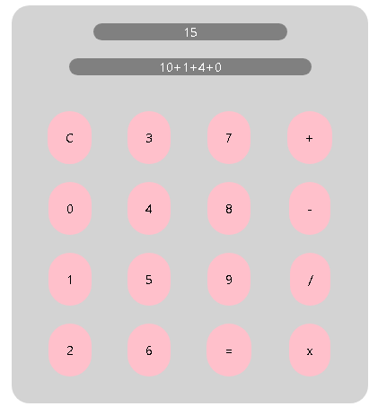

**Requisitos**:
- teclado numerico funcional
- aceitar numero composto (ex: 11, 122) -> versão anterior reescrevia o valor para subistituir 
- botoes de operação funcional
- aceitar multiplos operadores simples em uma equação
- atualizar o resultado conforme as operaçoes
- botão de clear
- botão de igual para finalizar uma equação
- não permitir user input sem operador, a não ser que resutlado seja null ou 0
  
